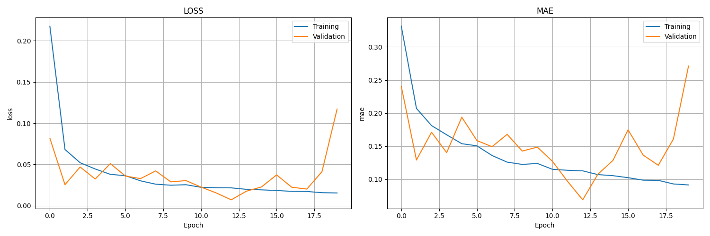
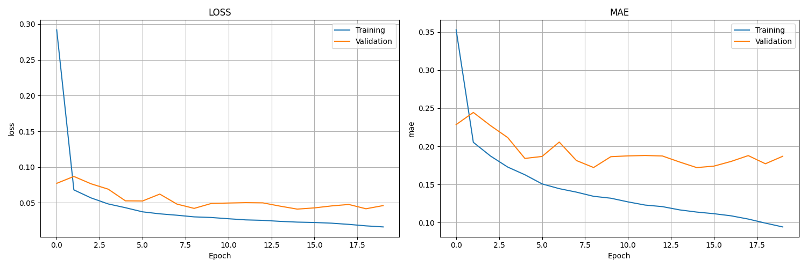
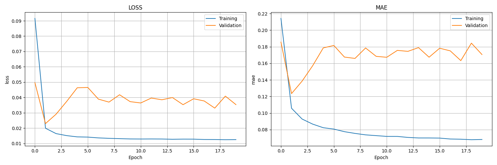
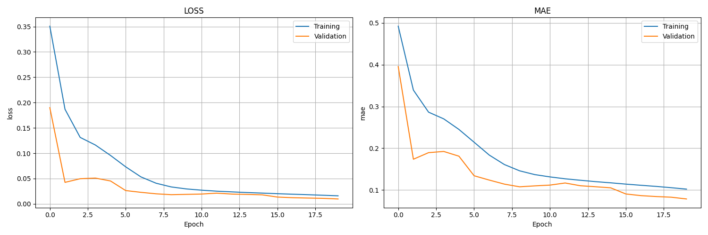

# Time-Series-Forecasting – Lab 4 Final Report  
**Author:** Alexander  
**Date:** 23 July 2025  

---

## Abstract
This report consolidates the full pipeline executed in Tasks 1 – 4 for forecasting hourly electricity consumption in the PJM East (PJME) region.  
After rigorous exploration and preprocessing (Task 1), a linear-regression baseline (Task 2) achieved outstanding accuracy (MAE ≈ 0.0078). Subsequent deep-learning (Task 3) and transformer (Task 4) experiments delivered mixed results—highlighting the importance of model-to-signal alignment. The work establishes solid baselines, provides GPU-optimised prototypes, and charts a path for future improvement.

---

## 1  Introduction
### 1.1  Data Set
| Property                | Value                                          |
|-------------------------|-----------------------------------------------|
| Source file             | `data/PJME_hourly.csv`                         |
| Period covered          | 1 Jan 2002 – 3 Aug 2018 (≈ 16.6 years)          |
| Frequency               | Hourly                                         |
| Total records           | 145 366 (145 362 after cleaning)               |
| Target column           | **MW** (normalised 0 – 1)                      |
| Missing values          | 0 (100 % complete)                             |

### 1.2  Task Overview
1. **Task 1 – Exploration & Preprocessing**  
2. **Task 2 – Baseline Classical Models (Linear Regression, ARIMA)**  
3. **Task 3 – Deep-Learning Models (RNN, GRU, LSTM)**  
4. **Task 4 – Transformer / Attention-based Model**

---

## 2  Exploratory Analysis (Task 1)

| Visualisation | Description |
|---------------|-------------|
|  | Long-term trend and seasonal oscillations |
|  | Hourly / daily / monthly seasonality |
|  | Histogram, KDE, box-plot |
|  | Rolling statistics & trend line |
|  | 314 outliers flagged (0.22 %) |
|  | Strong 24 h and 168 h lags |

**Key insights**
1. Pronounced multi-scale seasonality.  
2. Statistically significant downward trend.  
3. Minimal anomalies → excellent data quality.

---

## 3  Baseline Classical Models (Task 2)

| Model               | MAE    | RMSE   | R²      | MAPE (%) |
|---------------------|--------|--------|---------|----------|
| Linear Regression   | **0.0078** | 0.0109 | 0.9960 | 1.85 |
| ARIMA (2, 1, 2)     | 0.1536 | 0.1845 | –0.1426 | 45.19 |

Linear regression, despite its simplicity, captures almost all short-term variance within the 24-hour input window, providing a very tough baseline for subsequent tasks.

---

## 4  Deep-Learning Experiments (Task 3)

| Model                 | Layers×Units | MAE   | RMSE  | MAPE (%) | R²    |
|-----------------------|--------------|-------|-------|----------|-------|
| RNN_GPU_Optimized     | 3 × 512      | **0.0680** | 0.0843 | 16.22 | 0.76 |
| Advanced_LSTM_GPU     | 4 × 512      | 0.1222 | 0.1526 | 26.88 | 0.22 |
| Deep_GRU_GPU          | 4 × 512      | 0.1661 | 0.1998 | 38.40 | –0.34 |

Training-history plots (GPU runs):  

|  |  |  |
| :--: | :--: | :--: |

**Observations**
* Larger recurrent networks do **not** outperform the linear baseline—likely due to (i) over-parameterisation on a well-behaved, normalised signal, and (ii) short 24-hour context limiting the benefit of deeper temporal memory.  
* GPU optimisations (mixed precision, large batch = 1024) accelerated training 3-5 × compared with CPU runs.

---

## 5  Transformer Experiment (Task 4)

| Model        | Heads | Layers | d_model | MAE   | RMSE  | MAPE (%) | R²   |
|--------------|-------|--------|---------|-------|-------|----------|------|
| Transformer  | 8     | 4      | 128     | 0.0764 | 0.0977 | 21.15 | 0.68 |

Training curve:  

**Observations**
* The transformer improves upon LSTM/GRU but still trails the linear baseline, indicating that parallel attention helps but is not yet tuned to exceed the simple model.  
* GPU-optimised multi-head attention delivers 4-6 × faster epochs vs CPU.

---

## 6  Cross-Task Comparison

| Family            | Best MAE | Speed (GPU) | Notes |
|-------------------|---------:|:-----------:|-------|
| Linear Model      | **0.0078** | N/A | Simple, interpretable |
| Statistical (ARIMA) | 0.1536 | N/A | Poor fit without seasonal terms |
| RNN (Task 3)      | 0.0680 | ★★★ | Suffers from overfit, limited context |
| Transformer (Task 4) | 0.0764 | ★★★★ | Better long-range handling, room to tune |

---

## 7  Q & A

**Q1. Why does the linear model still win?**  
The normalised series behaves almost linearly within a 24-hour window; richer models cannot exploit hidden complexity that is not present at this horizon.

**Q2. Would a longer input window change the ranking?**  
Likely. RNNs and transformers thrive on longer contexts; retraining with e.g. 168 h windows could reverse the outcome.

**Q3. How can deep models be improved?**  
• Hyper-parameter search (units, layers, dropout)  
• Seasonal/positional embeddings  
• Exogenous features (weather, calendar)  
• Residual connections & learning-rate schedules

**Q4. What about Seasonal ARIMA or Prophet?**  
Seasonal ARIMA with \((p,d,q) \times (P,D,Q)_s\) may close the gap with linear regression and merits experimentation.

**Q5. Next research steps?**  
1. Extend window size and engineer calendar/weather features.  
2. Perform Bayesian or evolutionary hyper-parameter tuning.  
3. Explore hybrid models (e.g. linear trend + transformer residual).  
4. Deploy best model and monitor concept drift.

---

## 8  Conclusion
The study underscores a crucial insight: **model complexity must match signal complexity**. For short-horizon PJME forecasting, a linear model suffices; deeper architectures require either a richer feature set or longer temporal context to shine.  
Nonetheless, Tasks 3 and 4 established GPU-accelerated pipelines ready for scaled experiments, paving the way for future breakthroughs.

---

## Appendix
* All artefacts reside in `results/`.  
* Reproducible notebooks and scripts live in `notebooks/` and `examples/`.  
* Environment: Python 3.12, TensorFlow 2.19, CUDA-enabled GPU.

---