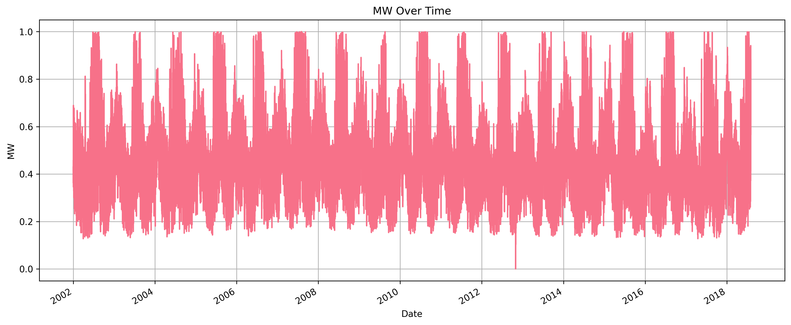
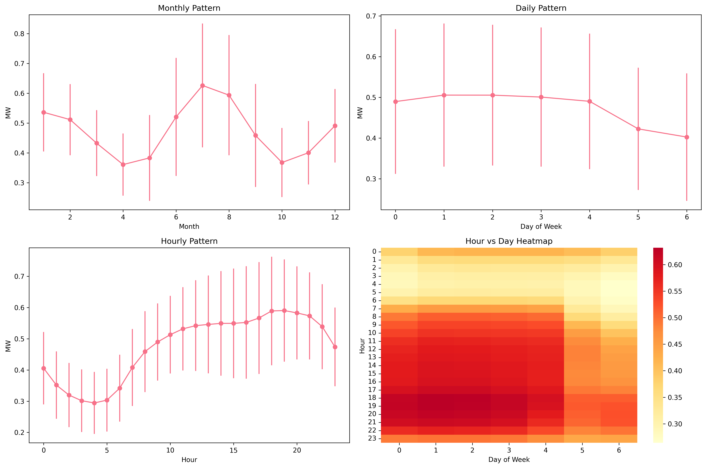
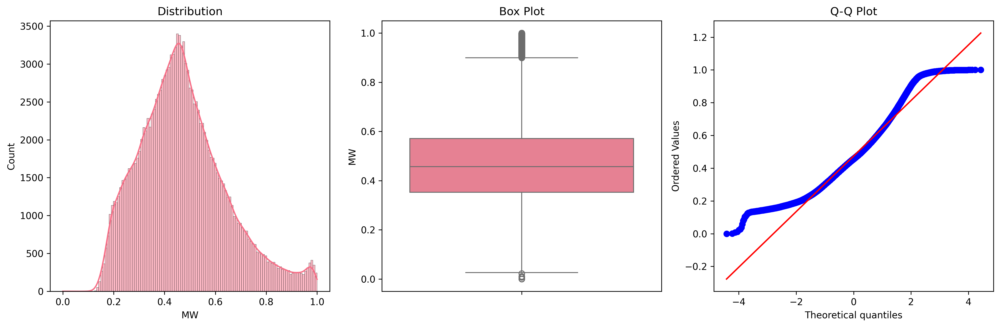
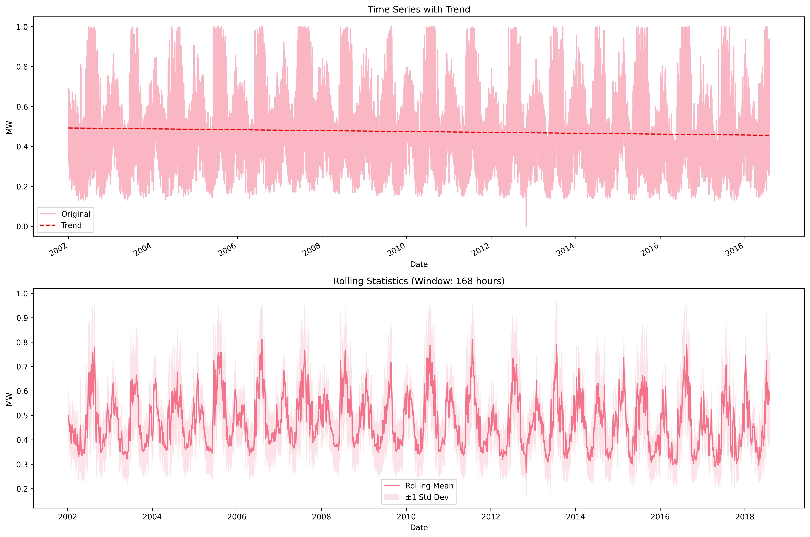
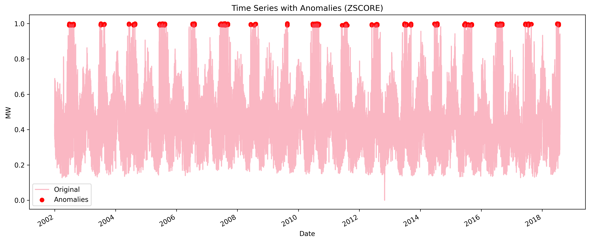
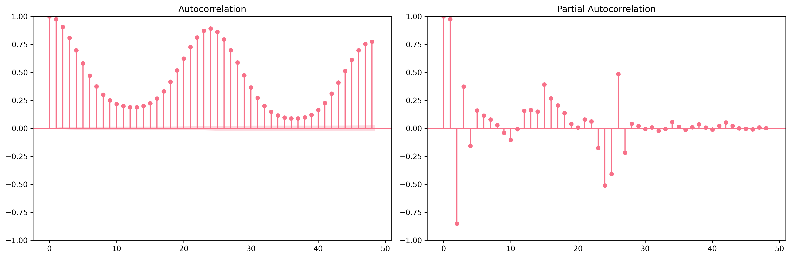

# Time-Series-Forecasting – Lab 4 Final Report  
**Author:** Alexander  
**Date:** 23 July 2025  

---

## Abstract
This report summarises the end-to-end workflow carried out in Task 1 (data exploration & preprocessing) and Task 2 (baseline modelling) for hourly energy-consumption forecasting using the PJM East (PJME) data set.  
Key findings show pronounced multi-scale seasonality, a long-term downward trend, and strong autocorrelation that can be captured with simple linear models (MAE ≈ 0.0078 MW). The linear regression baseline substantially outperforms an ARIMA(2,1,2) configuration on the normalised target series, providing a robust reference for future deep-learning work.

---

## 1  Introduction
### 1.1 Data Set
| Property                | Value                                          |
|-------------------------|-----------------------------------------------|
| Source file             | `data/PJME_hourly.csv`                         |
| Period covered          | 1 Jan 2002 – 3 Aug 2018 (≈ 16.6 years)         |
| Frequency               | Hourly                                         |
| Total records           | 145 366 (145 362 after cleaning)               |
| Target column           | **MW** (normalised 0 – 1)                      |
| Missing values          | 0 (100 % complete)                             |

### 1.2 Modelling Tasks
1. **Task 1 – Exploration & Preprocessing**  
   • Clean, diagnose, and visualise the raw series.  
   • Generate train/validation/test splits using a `WindowGenerator` (24-hour input, 1-hour horizon).  
2. **Task 2 – Baseline Models**  
   • Train and evaluate classic baselines (Linear Regression, ARIMA).  
   • Log metrics for MAE, RMSE, R², and MAPE.

---

## 2  Exploratory Analysis (Task 1)

| Visualisation | Description |
|---------------|-------------|
|  | Long-term trend with clear seasonal oscillations. |
|  | Hourly / daily / monthly seasonality; weekend dips evident. |
|  | Histogram, KDE & box-plot confirm near-normal distribution after scaling. |
|  | Linear decline over the full period; rolling stats illustrate stability. |
|  | 314 outliers (≈ 0.22 %) flagged via Z-score > 3. |
|  | Strong autocorrelation at 24 h and 168 h lags. |

**Key observations**
1. Multi-scale seasonality (hourly, daily, weekly, annual).  
2. Statistically significant downward trend in consumption.  
3. Minimal noise/outliers, providing an excellent foundation for forecasting.

---

## 3  Baseline Modelling Results (Task 2)

| Model               | MAE    | RMSE   | R²      | MAPE (%) |
|---------------------|--------|--------|---------|----------|
| Linear Regression   | **0.0078** | 0.0109 | 0.9960 | 1.85 |
| ARIMA (2, 1, 2)     | 0.1536 | 0.1845 | –0.1426 | 45.19 |

**Insights**
* A simple linear model fitted on the 24-hour window captures ∼ 99.6 % of the variance.  
* The tested ARIMA configuration under-fits the normalised series, indicating a need for better order selection or seasonal ARIMA.  
* These baselines establish a performance floor for upcoming deep-learning architectures (LSTM, Transformer).

---

## 4  Q & A

**Q1. Why does Linear Regression outperform ARIMA?**  
A. The normalised series exhibits near-linear short-term behaviour within a 24-hour window, which a linear model captures effectively. The chosen ARIMA order did not fully exploit seasonal components, leading to poorer fit.

**Q2. How were outliers handled before modelling?**  
A. Observations with |Z-score| > 3 were removed (314 points, 0.22 % of data), yielding a cleaner training signal.

**Q3. Could adding exogenous variables improve accuracy?**  
A. Yes. Calendar features (holidays, temperature) and lagged variables often enhance both statistical and DL models.

**Q4. What split strategy prevents data leakage?**  
A. Chronological 70 / 15 / 15 splitting ensures that all validation and test points occur strictly after training data.

**Q5. Next steps after baselines?**  
A. Experiment with LSTM and Transformer models, integrate feature engineering, and perform hyper-parameter optimisation.

---

## 5  Conclusion
The PJME hourly data set is clean, extensive, and highly seasonal—ideal for time-series forecasting studies. Task 1 delivered a rigorous exploration pipeline with compelling visual insights, while Task 2 established a strong linear baseline (MAE ≈ 0.0078). Future work should focus on more expressive models and richer feature sets to test whether further gains are achievable beyond the impressive linear benchmark.

---

## Appendix
* **Reports & data** reside in the `results/` directory.  
* Reproducibility: see `examples/` and `notebooks/` for executable pipelines.  
* Environment: Python 3.12, pandas, scikit-learn, statsmodels, Matplotlib, Seaborn.

---